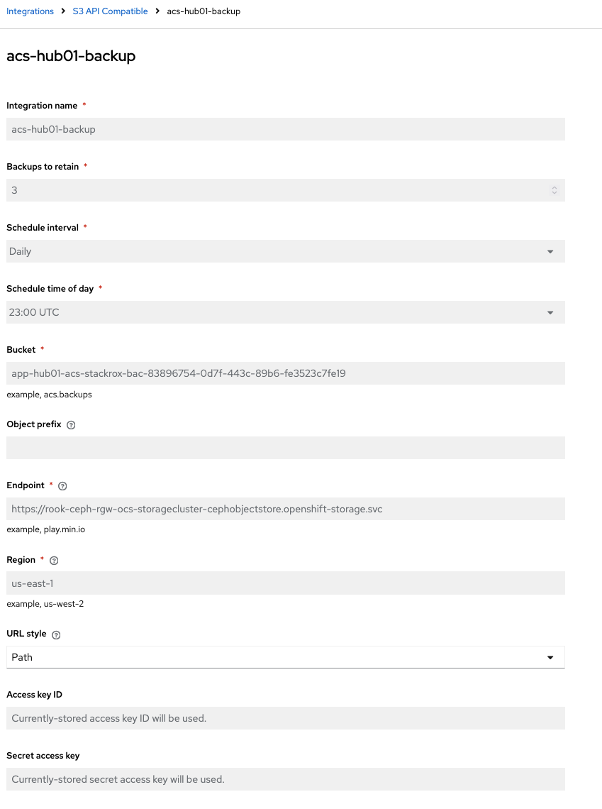
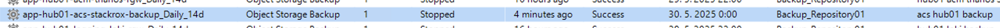

# ACS backup

ACS backup is provided directly by the product functionality.  
Backup is stored on S3 bucket which is create by [backup scripts](/backup/README.md). Later on the S3 is backed up by veeam.  

- Backup setup in ACS:  
  
- Backup job in veeam:  
