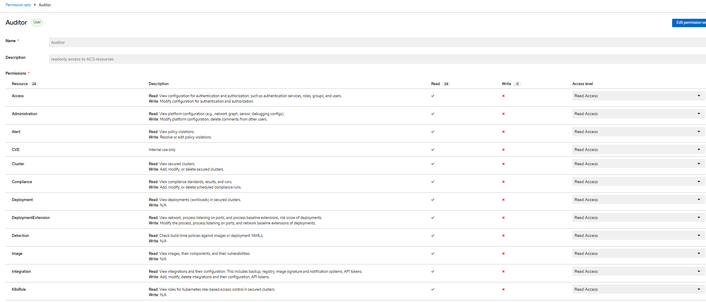
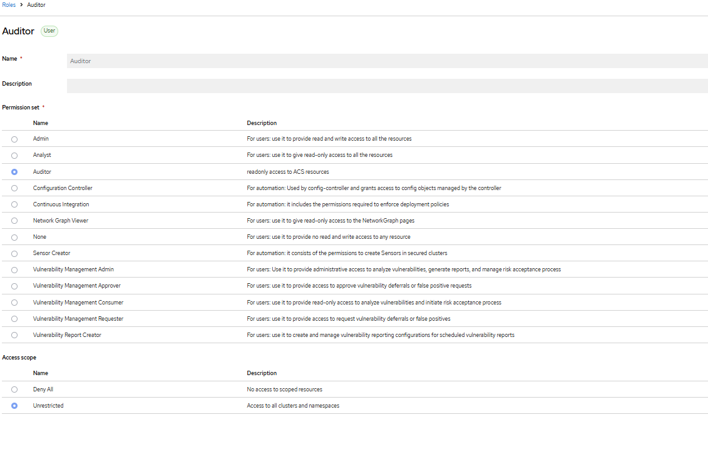
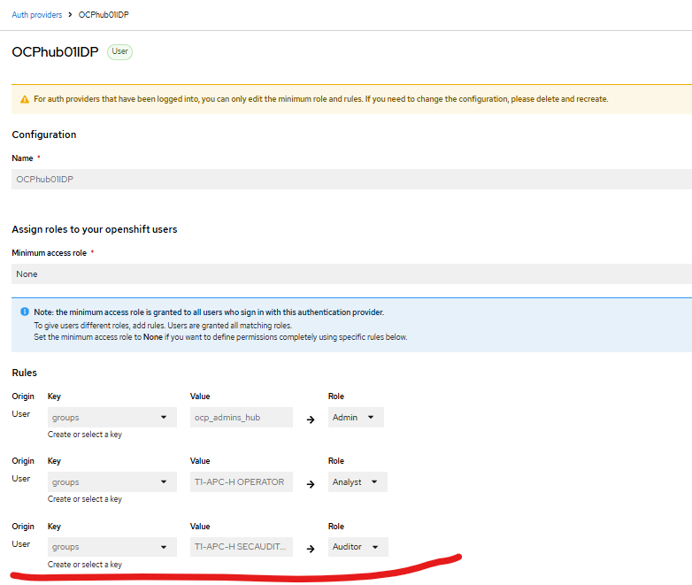
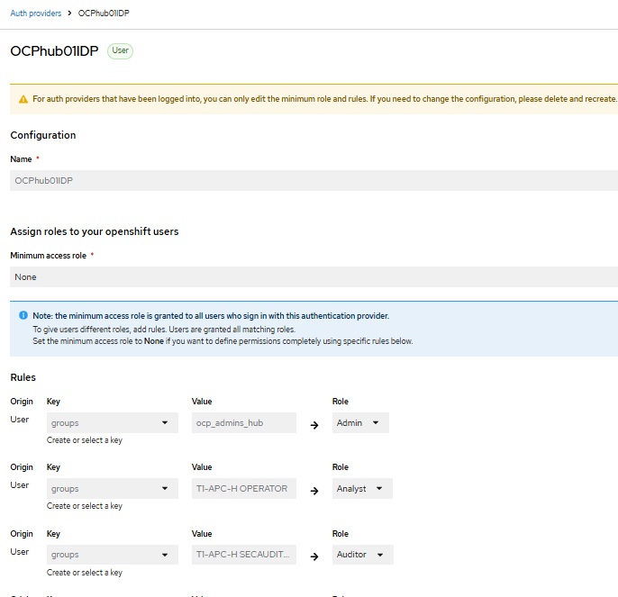

# ACS roles

## Auditor Custom Permission Set and Role

- [reference PrivateCloud documentation](https://github.com/gr8it/privatecloud/blob/develop/docs/openshift/security/acs-config-sso.md#custom-permission-set-and-role)

Custom permission set - Auditor:

- create new permission set and define for it access level Read Access for ALL ACS resources
- 

Custom role - Auditor:

- create new role, select permission set "Auditor" and Access Scope "Unrestricted"
- 

Assign role to group:

- select authentication provider and assign Auditor role to select group
- 

## Role assigments

- for authentication provider OCPhub01IDP set role assignment to following

