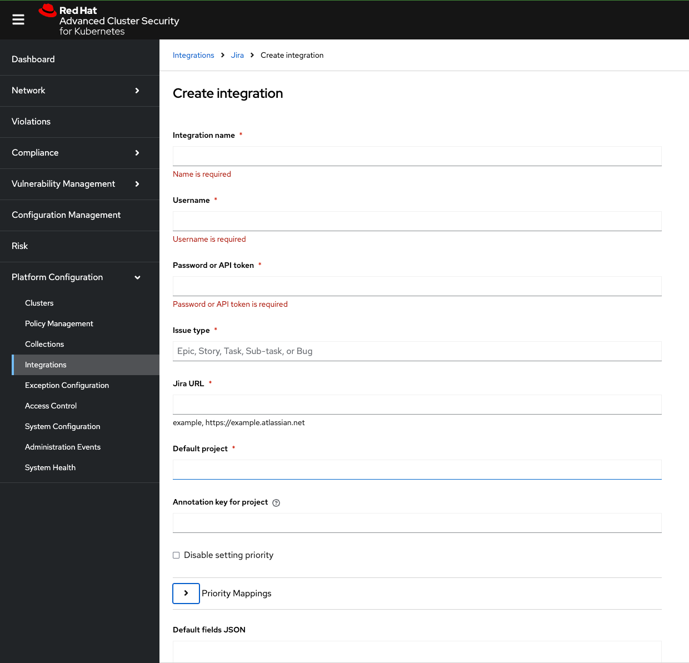

# ACS Security Policies

This directory contains Red Hat Advanced Cluster Security (RHACS) policy definitions in JSON format for import into ACS Central.

## Policies Included

### containers-critical-fixable-cves.json

**Purpose:** Detects containers with fixable Critical CVEs.

**Important:** The exported policy is **disabled by default** and remains **inform-only** when enabled. It does **not** block deployments or `oc debug` flows.

**Policy Behavior:**
- **Mode:** Disabled by default; inform-only when enabled
- **Scope:** Containers with fixable vulnerabilities at severity >= Critical
- **Lifecycle Stage:** DEPLOY (checks deployments, not runtime)
- **Enforcement Actions:** None (empty) - violations appear in ACS dashboard only
- **Notifiers:** Not configured (must be set up per environment)

**Why Inform-Only Mode?**
- Compatible with GitOps/ArgoCD workflows (no deployment blocking or auto-scaling)
- Allows vulnerability detection without operational disruption
- Team can review violations and remediate through Git commits
- Prevents conflicts between ACS enforcement and ArgoCD reconciliation

## Namespace Exclusions

The policy excludes these namespaces from scanning:

- **Core Kubernetes/OpenShift:**
  - `kube-system`
  - `openshift` (exact match)
  - `openshift-*` (all openshift- prefixed namespaces)

- **Security & Management:**
  - `stackrox` (ACS Central/Scanner)
  - `open-cluster-management`
  - `hive`
  - `hypershift`

- **Cluster Infrastructure:**
  - `infrastructure-*` (regex pattern for all infrastructure namespaces)
  - `klusterlet-*` (regex pattern for managed cluster agents)

- **HCP Hosted Cluster Namespaces:**
  - `dev01`, `dev01-dev01`
  - `test01`, `test01-test01`
  - `prod01`, `prod01-prod01`

**Note:** Update the exclusions list via UI after import if your environment has additional core namespaces.

## How to Import the Policy

### Prerequisites
- RHACS Central instance is deployed and accessible
- You have admin access to ACS Central
- For CLI import: `roxctl` CLI tool installed

### Option 1: Import via ACS UI

1. Log in to ACS Central web console
2. Navigate to **Platform Configuration → Policy Management**
3. Click **Import policy** button
4. Upload `containers-critical-fixable-cves.json`
5. Review the policy details, especially that it imports as disabled
6. Click **Import**
7. Edit the policy and enable it after notifier setup and validation

## Jira Integration Status

The policy ships without notifiers configured (`"notifiers": []`) to ensure portability across environments.

Current verified state:
- Native RHACS Jira notifier works and successfully creates `Task` issues in project `SPEXAPC`.
- RHACS Generic Webhook to Jira Operations API integration was tested and failed with `invalid arguments` because Jira Alert API expects a different payload shape than RHACS sends.
- Jira-side webhook integration that might help with payload translation is not available in the current Jira package.
- Final architecture decision is pending review with architects.

As of now, the realistic options are:
- Use the native RHACS Jira notifier described below.
- Keep the existing ACS -> Loki -> Alertmanager -> Jira Team path.
- Build a small adapter that translates RHACS webhook payloads into Jira Operations alert payloads.

### HUB Jira Values

Use these values in ACS for the native Jira notifier:

| ACS Jira field | Value |
|---|---|
| Integration name | `ACS-to-Jira-SPEXAPC-Security` |
| Jira URL | `https://aspecta.atlassian.net` |
| Username / Email | Jira user or service account with access to create issues in `SPEXAPC` |
| Password or API token | Jira API token for that user |
| Default project | `SPEXAPC` |
| Issue type | `Task` |
| Verify TLS | Enabled |
| Disable setting priority | Unchecked |
| CRITICAL_SEVERITY | `Highest` |
| HIGH_SEVERITY | `High` |
| MEDIUM_SEVERITY | `Medium` |
| LOW_SEVERITY | `Low` |

Observed behavior from the RHACS Jira test:
- RHACS creates a Jira work item directly in project `SPEXAPC`
- the test created a `Task`
- the created item is a normal Jira issue, not a Jira Operations alert

### ACS Setup Steps

1. **Create notifier integration in ACS:**
   - Navigate to **Platform Configuration → Integrations → Notifier Integrations**
   - Click **New Integration**
   - Select **Jira**
   - Fill the form with the exact values listed above
   - Test the integration
   - Save

   **Example: Jira Integration Setup**

   

   Use the screenshot fields like this:
   - **Integration name**: `ACS-to-Jira-SPEXAPC-Security`
   - **Username**: Jira service account from Vault or Jira admin
   - **Password or API token**: Jira API token from Vault or Jira admin
   - **Issue type**: `Task`
   - **Jira URL**: `https://aspecta.atlassian.net`
   - **Default project**: `SPEXAPC`
   - **Annotation key for project**: leave empty
   - **Disable setting priority**: unchecked
   - **Priority Mapping: CRITICAL_SEVERITY**: `Highest`
   - **Priority Mapping: HIGH_SEVERITY**: `High`
   - **Priority Mapping: MEDIUM_SEVERITY**: `Medium`
   - **Priority Mapping: LOW_SEVERITY**: `Low`

2. **Attach notifier to this policy:**
   - Navigate to **Platform Configuration → Policy Management**
   - Find policy: "Containers with Critical Fixable CVEs"
   - Click **Actions → Edit policy**
   - Scroll to **Policy Behavior** section
   - Under **Configure notifications**, attach your notifier(s)
   - Enable the policy after the notifier is configured and tested
   - Save

### Validation Checklist

1. In ACS, run **Test Integration** and confirm success.
2. Verify that the test creates or validates creation of a Jira issue in project `SPEXAPC`.
3. Remember that the RHACS Jira notifier creates Jira issues, not Jira Operations alerts.
4. Attach the notifier only to the intended policy.
5. Trigger a controlled test violation in a non-production namespace.
6. Confirm exactly one Jira issue is created in `SPEXAPC`.

### Jira Operations API Note

The following path was tested and is not currently viable without a translator:
- RHACS Generic Webhook -> Jira Operations API integration (`https://api.atlassian.com/jsm/ops/integration/v2/alerts`)

Reason:
- RHACS Generic Webhook sends a fixed payload containing an `alert` object and optional extra fields.
- Jira Operations Alert API expects Jira alert fields such as `message`, `alias`, `description`, `priority`, and `details` at the top level.
- Direct posting from RHACS to Jira Operations API therefore fails on payload validation.

Do not store Jira credentials in Git, Helm values, or this chart. Keep them in Vault and inject them only at runtime.
