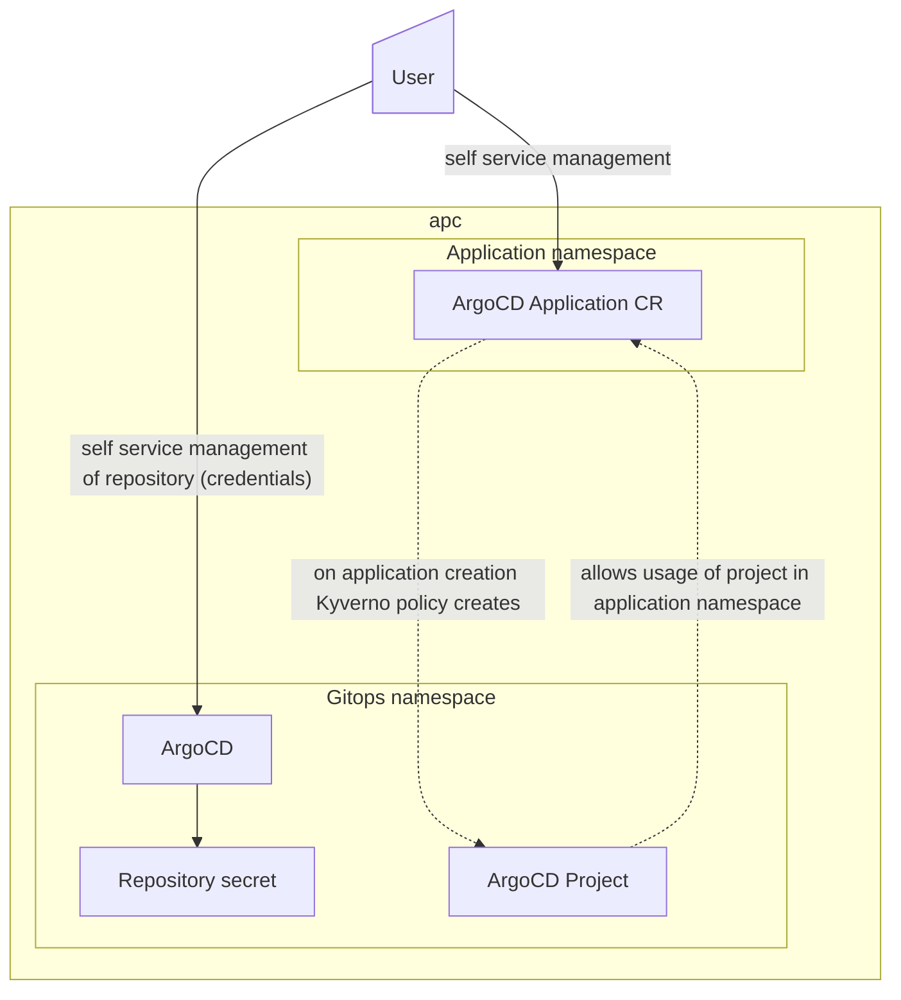

# Application Gitops



Component allows self service of application gitops by app teams:

1) User creates ArgoCD application in application namespace matching the namespace name, e.g.

   ```yaml
   apiVersion: argoproj.io/v1alpha1
   kind: Application
   metadata:
     name: moodle
     namespace: moodle
   spec:
     destination:
       namespace: moodle
       server: https://kubernetes.default.svc
     project: moodle
     source:
       helm:
         releaseName: moodle
         valueFiles:
           - ../../values.dev.yaml
       path: charts/apc-moodle
       repoURL: https://github.com/gr8it/moodle.git
       targetRevision: HEAD
   ```

> [!NOTE]  
> Uses [App in any namespace](https://argo-cd.readthedocs.io/en/stable/operator-manual/app-any-namespace/) feature

2) APC creates an ArgoCD Appproject with the same name as the application namespace where ArgoCD Application was created in

3) APC sets up dedicated service account with APC admin role, which is used for deployment of resources to the application namespace

4) User creates a repository with credentials in ArgoCD

## Security

- Created ArgoCD application project allows only ArgoCD application CRs from namespace matching the application namespace name (= name of the namespace of the originating ArgoCD application CR)

- Role groups of the application namespace are mirrored to ArgoCD aligned as much as possible to their kubernetes counterparts
  
  |role|applications|repositories|resources|exec|logs|
  |---|---|---|---|---|---|
  |PJA|FULL|YES|FULL|YES|YES|
  |OPR|READ|YES|READ+SYNC|YES|YES|
  |TES**|READ|NO|READ+SYNC|YES|YES|
  |DEV**|READ|NO|READ+SYNC|YES|YES|
  |VIE|READ|NO|READ|NO|NO|

  ** dev and test environments only

  > Where:  
  > role = APC project role  
  > applications = management of the ArgoCD application  
  > repositories = management of the ArgoCD project git repository  
  > resources = management of the resources deployed by ArgoCD, including sync and lifecycle management
  > exec = exec into pod
  > logs = view logs

  <https://argo-cd.readthedocs.io/en/stable/operator-manual/rbac/#the-applications-resource>

- Only repo specified in `allowedGitDomain` is allowed to be used with created ArgoCD application projects
- One ArgoCD application project is created per namespace matching namespace name
- Because ArgoCD uses service account with APC admin role (PJA), all git users with push privilege to the target ArgoCD application branch are ~ project admins in the particular ArgoCD application environment!

> [!WARNING]  
> Git user access is very important from security perspective = in the APC user responsibility
 
> [!NOTE]  
> Uses alpha feature [Application Sync using impersonation](https://argo-cd.readthedocs.io/en/stable/operator-manual/app-sync-using-impersonation/)
