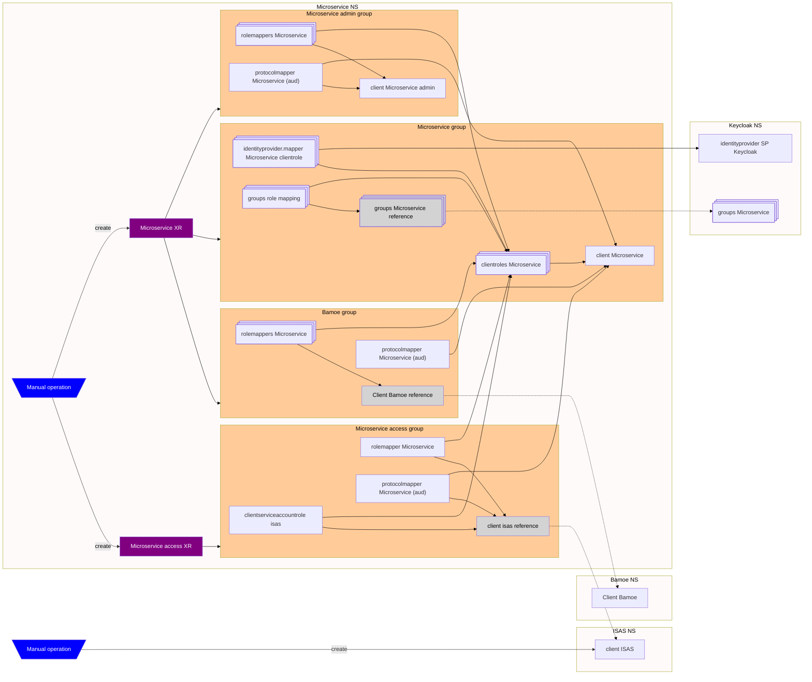

# Apps Centralne Komponenty

## Architecture



DOPLNIT GROUPS a GROUP ROLE MAPPING do obrazku .. 
+ prerobit do mermaid?

Due to inefficiencies of RHBK / Kubernetes RBAC (for example allow creation and modification of a Keycloak client, but don't allow modification of any existing client) it is not possible to allow user selfservice their Keycloak configuration directly using Crossplane Managed Resources (MR). As such Crossplane Composite resources (XR) were used to work around this RBAC limitation, i.e. project admins / operators are able to manage XR composites, which will manage required Keycloak MRs in an controlled way.

There are two XRDs:

- [microservice.bpm.ck.socpoist.sk](#microservice)
- [microserviceaccess.bpm.ck.socpoist.sk](#microservice-access)

Usage of APC Keycloak is preferred due to operational complexity of running a Keycloak instance 24/7

## Prerequisites

- Crossplane 2.0+ installed (required for namespaced resources)
- Crossplane XR functions go-templating / auto-ready installed (see[crossplane-xr-functions](../crossplane-xr-functions/))
- Keycloak instance user with admin role
- Crossplane keycloak provider installed (see [crossplane-keycloak-provider](../crossplane-keycloak-provider/)) and configured (see [crossplane-keycloak-provider-bootstrap](../crossplane-keycloak-provider-bootstrap/))
  - Requires local user with admin role in the master realm of Keycloak!
- IDP provider in Keycloak targeting SP Keycloak

## Microservice

Using the microservice.bpm.ck.socpoist.sk XR allows projet admins / operators to create a BPM microservice consisting of:

- create a Keycloak client representing the particular microservice = `client microservice`
- add list of roles (scopes) to the microservice client = `clientrole microservice`

- add a IDP mapping between AD groups (taken from upstream SP Keycloak access token) and created roles. AD groups must follow naming convention, `APC-<environmentShortName>-CK-<microserviceName>-<roleName>` all in uppercase, e.g. APC-D-CK-BPM-READER = `identityprovider.mapper microservice clientrole`

- create a Keycloak client for the admin interface = `client microservice admin`
- add microservice roles to tokens created by microservice admin client, required because full scope is disabled for the client to increase security = `rolemapper microservice admin`
- add microservice audience to tokens created by microservice admin client, so the access tokens can be used by the microservice API = `protocolmapper microservice admin`

- target the Bamoe Keycloak client (read only) = `client bamoe`
- add microservice roles to tokens created by Bamoe client, required because full scope is disabled for the client to increase security = `rolemapper bamoe`
- add microservice audience to tokens created by Bamoe client, so the access tokens can be used by the microservice API = `protocolmapper bamoe`

See [Usage](#usage-example-microservice) for an example.

## Microservice Access

> [!NOTE]  
> A client in Keycloak representing IS Agenda System requiring access must exist - see [IS Agenda Systems](#is-agenda-systems) = `client isas`

Using the microserviceaccess.bpm.ck.socpoist.sk XR allows projet admins / operators to manage access to a BPM microservice for IS Agenda Systems consisting of:

- add microservice roles to tokens created by IS Agenda System client, required because full scope is disabled for the client to increase security = `rolemapper isas`
- add microservice audience to tokens created by IS Agenda System client = `protocol mapper isas (aud)`
- add a role to the client service account of the IS Agenda System client = `clientserviceaccountrole isas`

See [Usage](#usage-example-microservice-access) for an example.

### IS Agenda Systems

Several options were considered for Agenda Systems connecting to APIs:

1) trusting token from SP Keycloak on API = not recommended
2) token exchange v1 = not standard / preview only / no support
3) connecting AS clients to APC Keycloak = implementation on client side (with client auth implementation is very easy)

Although a requirement on client (AS) side implementation, option 3) has been selected.

Such clients should be created using Keycloak component via `.Values.clients[]`. The resulting client should look like:

```yaml
# Source: keycloak/templates/client.yaml
apiVersion: openidclient.keycloak.m.crossplane.io/v1alpha1
kind: Client
metadata:
  name: isas
  namespace: apc-keycloak
spec:
  forProvider:
    realmId: AppDEV
    clientId: isas # must match name of the microserviceaccess!
    name: ISAS
    description: ISAS client for Keycloak
    accessType: CONFIDENTIAL

    serviceAccountsEnabled: true

    pkceCodeChallengeMethod: S256
    useRefreshTokens: true
    fullScopeAllowed: false

    frontchannelLogoutEnabled: true

  providerConfigRef:
    name: keycloak-provider-config
    kind: ClusterProviderConfig
```

## Usage Example Microservice

Create a BPM microservice, with roles admin, worker, reader, and set of URLs:

```yaml
apiVersion: bpm.ck.socpoist.sk/v1alpha1
kind: Microservice
metadata:
  name: bpm-test-prime
  namespace: bpm-test-prime
spec:
  roles:
    - admin
    - worker
    - reader

  rootUrl: https://bpm-test-prime.apps.example.com/admin/processes
  baseUrl: https://bpm-test-prime.apps.example.com
  validRedirectUris:
    - https://bpm-test-prime.apps.example.com/admin/q/oidc/callback
  webOrigins:
    - https://bpm-test-prime.apps.example.com/admin/processes
```

### Usage Example Microservice Access

Add reader access for ISAS to BPM microservice

```yaml
apiVersion: bpm.ck.socpoist.sk/v1alpha1
kind: Microserviceaccess
metadata:
  name: isas
  namespace: bpm-test-prime
spec:
  clientId: bpm-test-prime
  clientRole: reader
```

> [!NOTE]  
> as a prerequisite, a client isas must exist in Keycloak! E.g.

```yaml
apiVersion: openidclient.keycloak.crossplane.io/v1alpha1
kind: Client
metadata:
  name: isas
spec:
  deletionPolicy: Delete
  forProvider:
    realmId: AppDEV
    clientId: isas # must match name of the microserviceaccess!
    name: isas # human readable format
    description: isas description
    accessType: CONFIDENTIAL
    standardFlowEnabled: true
    serviceAccountsEnabled: true
    baseUrl: https://isas.example.com
    rootUrl: https://isas.example.com
    useRefreshTokens: true
    validRedirectUris:
    - https://isas.example.com/login
    webOrigins:
    - https://isas.example.com
    frontchannelLogoutEnabled: true
    pkceCodeChallengeMethod: S256
    fullScopeAllowed: false
  providerConfigRef:
    name: keycloak-provider-config
```

## XRD generation

OpenAPI schemas were generated using <https://json.ophir.dev>, and are as is stored in the [openapischemas](openapischemas/) folder.

To transform the OpenAPI schemas into XRD, yq can be used, e.g.:

```bash
yq ".spec.versions[0].schema.openAPIV3Schema = \"$(yq -p json -o yaml openapischemas/xrd-microservice.json)\"" --inplace templates/xrd-microservice.yaml
```

## TODO

- test in SP dev01
  - deploy to test / prod
- agree on interconnection of APC Keycloak with SP Keycloak
  - implement (in code?)
- make microservice CR be ready without optional groups / roles being ready
