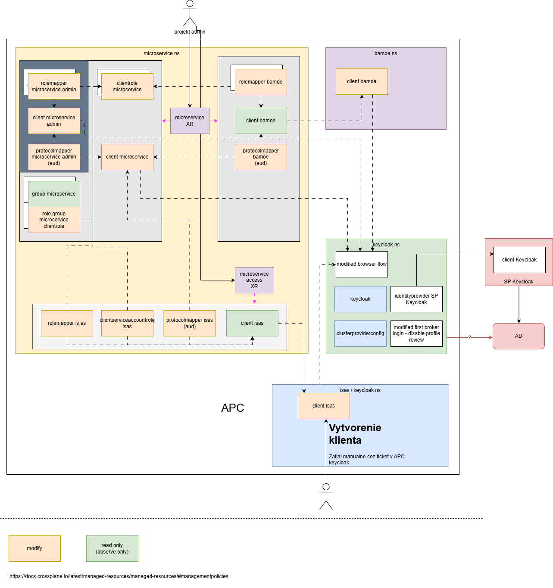

# Apps Centralne Komponenty

## Architecture



Due to inefficiencies of RHBK / Kubernetes RBAC (for example allow creation and modification of a Keycloak client, but don't allow modification of any existing client) it is not possible to allow user selfservice their Keycloak configuration directly using Crossplane Managed Resources (MR). As such Crossplane Composite resources (XR) were used to work around this RBAC limitation, i.e. project admins / operators are able to manage XR composites, which will manage required Keycloak MRs in an controlled way.

There are two XRDs:

- microservice.ck.socpoist.sk
- microserviceaccess.ck.socpoist.sk

### Microservice

Using the microservice.ck.socpoist.sk XR allows projet admins / operators to:

- create a Keycloak client representing the particular microservice = `client microservice`
- add list of roles (scopes) to the microservice client = `clientrole microservice`
- add a mapping between AD groups (read only) and created roles. AD groups must follow naming convention, `APC-<environmentShortName>-CK-<microserviceName>-<roleName>` all in uppercase, e.g. APC-D-CK-BPM-READER = `group microservice` + `role group microservice clientrole`

- create a Keycloak client for the admin interface = `client microservice admin`
- add microservice roles to tokens created by microservice admin client, required because full scope is disabled for the client to increase security = `rolemapper microservice admin`
- add microservice audience to tokens created by microservice admin client, so the access tokens can be used by the microservice API = `protocolmapper microservice admin`

- target the Bamoe Keycloak client (read only) = `client bamoe`
- add microservice roles to tokens created by Bamoe client, required because full scope is disabled for the client to increase security = `rolemapper bamoe`
- add microservice audience to tokens created by Bamoe client, so the access tokens can be used by the microservice API = `protocolmapper bamoe`

### Microservice Access

> [!NOTE]  
> Keycloak [https://www.keycloak.org/2025/05/fgap-kc-26-2](Fine-Grained Admin Permissions), are not yet available for RHBK, and don't allow required level of RBAC.

## XRD generation

OpenAPI schemas were generated using <https://json.ophir.dev>, and are as is stored in the [openapischemas](openapischemas/) folder.

To transform the OpenAPI schemas into XRD, yq can be used, e.g.:

```bash
yq ".spec.versions[0].schema.openAPIV3Schema = \"$(yq -p json -o yaml openapischemas/xrd-microservice.json)\"" --inplace templates/xrd-microservice.yaml
```
