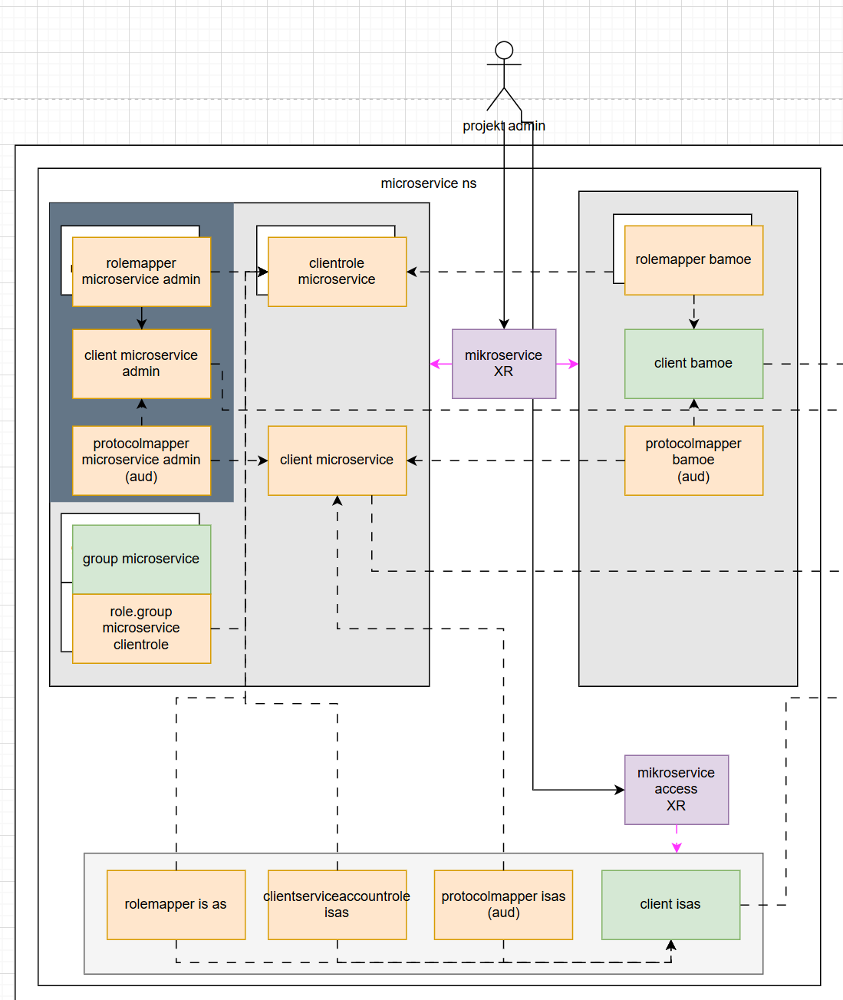

# Apps Centralne Komponenty

## Architecture



## XRD generation

OpenAPI schemas were generated using <https://json.ophir.dev>, and are as is stored in the [openapischemas](openapischemas/) folder.

To transform the OpenAPI schemas into XRD, yq can be used, e.g.:

```bash
yq ".spec.versions[0].schema.openAPIV3Schema = \"$(yq -p json -o yaml openapischemas/xrd-microservice.json)\"" --inplace templates/xrd-microservice.yaml
```
