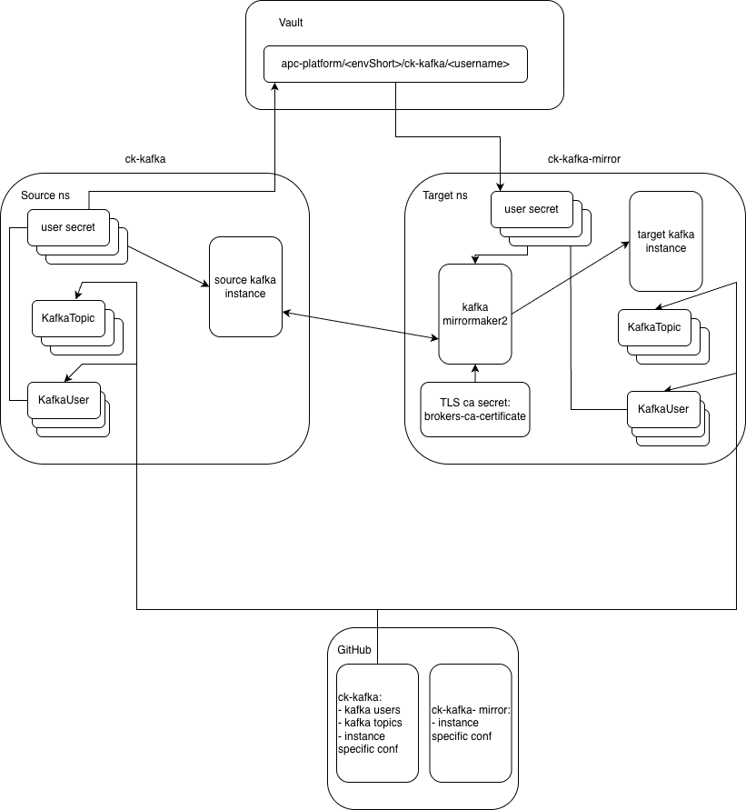

# APC Kafka MirrorMaker2

This chart creates a Kafka MirrorMaker2 instance and mirroring configuration for source and target Kafka instances. Kafka MirrorMaker2 is part of the Strimzi Kafka operator.

> [!NOTE]
> In actual implementation the mirroring is supported only in the same Openshift cluster.

## Design



- Kafka instancies (source and target instance) are deployed separately from chart [apps-ck-kafka](../apps-ck-kafka/README.md).
- Kafka users and kafka topics are managed via the apps-ck-kafka (source kafka also called upstreamComponent) component configuration in APC Gitops configuration and are idenctical across the source and target kafka instance.
- Kafka user password is generated in source kafka instance during the push to Vault and from Vault the secrets are synchronized in target kafka instance.
- Kafka MirrorMaker2 is deployed in the same namespace as the target kafka.
- Kafka MirrorMaker2 is connecting to bootstrap services of the kafka clusters and needs TLS CA for the communication to kafka instances.

## Deployment and configuration  

### Requirements

- cert-manager deployed and configured
- source kafka instance deployed
- target kafka instance deployed

</details>


### Configuration

Main MirrorMaker2 configuration is defined in helm chart [values file](./values.yaml). The source and target kafka cluster configuration is defined in component values file in APC Gitops.

| Configuration | Description | Options |
|---------------|-------------|---------|
| version: | Kafka Connect version | |
| replicas | Kafka MM2 no of replicas | |
| resources | Resources and limits for Kafka MM2 pod | |
| jvmOptions | JVM tuning options | |
| clusters | Map of clusters for Kafka MM2 | Map of cluster |
| clusters.<c-name>.type| Define from where to where the data are mirrored | source/target |
| clusters.<c-name>.bootstrapServers | Bootstrap service of the cluster, network policy in source clsuter NS have to allow the connection from NS where Kafka MM2 is deployed | |
| clusters.<c-name>.auth | User used for connection to specific cluster | |
| clusters.<c-name>.config | Specific Kafka MM2 configuration for specific cluster | |
| mirrors | Defines [Kafka MM2 conectors](https://strimzi.io/docs/operators/latest/full/deploying.html?#con-config-mirrormaker2-connectors-str) | Map of connectors |
| mirrors.<connector>.tasksMax | Amount of [tasks per connector](https://strimzi.io/docs/operators/latest/full/deploying.html?#con-mirrormaker-tasks-max-str), can be tuned for performance improved | |
| mirrors.sourceConnector.config.'config.sync.topic.acls.enabled' | Sets if the ACLs for topics are synced. As in our case we manage topics by kafka deployment this is disabled | false |
| mirrors.sourceConnector.config.'sync.topic.configs.enabled' | Sets if the topic configuration is synced. As in our case we manage topics by kafka deployment this is disabled | false |
| mirrors.sourceConnector.config.'replication.policy.class' | Sets [topic naming](https://strimzi.io/docs/operators/latest/full/deploying.html?#con-config-mirrormaker2-topic-names-str) in target cluster, we want same topic name on source and target cluster | "org.apache.kafka.connect.mirror.IdentityReplicationPolicy" |
| mirrors.checkpointConnector.config.'replication.policy.class' | Sets offset topic naming | "org.apache.kafka.connect.mirror.IdentityReplicationPolicy" |
| mirrors.checkpointConnector.config.'emit.checkpoints.enabled' | Periodically replicates consumer group offsets (checkpoints) from the source cluster to the target cluster | true |
| mirrors.checkpointConnector.config.'sync.group.offsets.enabled' | Replicate and translate consumer group offsets across different Kafka clusters | true |
| mirrors.heartbeatConnector.config.'heartbeats.topic.replication.factor' | Replication factor for hearbeat topic (-1 -> the same as on source) | -1 |
| monitoring | Monitoring configuration | |


### Users

There are required specific users and theirs configuration for source and target cluster with specific ACLs to topics. The users are defined in APC Gitops component for source cluster. Topic and users configuration from source cluster is used in target cluster during the component render. Users configuration for Kafka MM2 is described in [Kafka documentation](https://strimzi.io/docs/operators/latest/full/deploying.html?#proc-config-mirrormaker2-securing-connection-str). 

Example environment configuration for target kafka cluster:

```yaml
  apps-ck-kafka-mirror:
    render:
      chart: gr8it-openshift/apps-ck-kafka
      chartVersion: "1.3.0"
    destination:
      namespace: ck-kafka-mirror
    managedNamespaceMetadata:
      labels:
        apc.namespace.type: platform
    syncOptions:
      - CreateNamespace=true
    upstreamConfig: apps-ck-kafka
```

```upstreamConfig``` options specifies the upstream (parrent) component from which the configuration will be merged to this particular component
