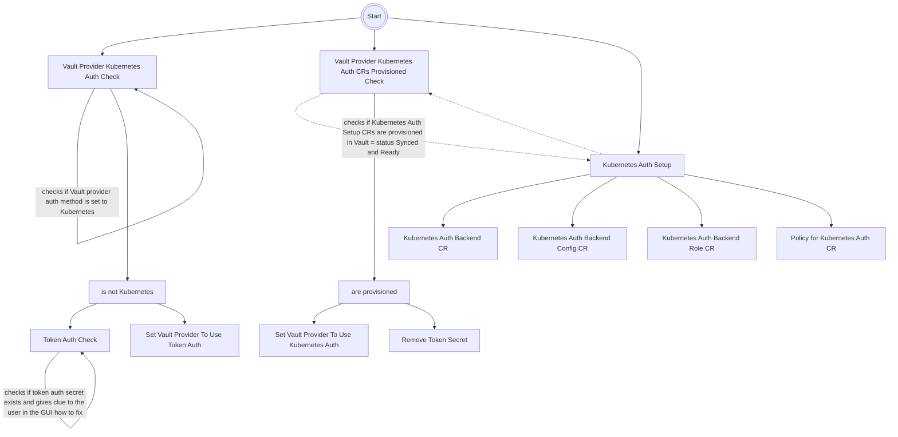
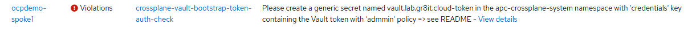

# Crossplane Vault Provider bootstrap



> [!NOTE]  
> The Crossplane Vault Provider bootstrap is not automatic, as it requires manual creation of an Vault token

> [!WARNING]  
> The Token secret must be created on the MANAGED CLUSTER, not on hub cluster!

> [!WARNING]  
> As the chart is implemented as an ACM policy, meaning the component has to be installed on the hub cluster only!

The chart is implemented as an ACM policy and does following:

- Checks if Vault ProviderConfig is using Kubernetes auth method
  - If yes => the target status
  - If not
    - Sets Vault Provider to use Token auth for bootstrap
    - Starts a helper policy to inform user in the GUI where to create the Token secret
- Starts Kubernetes Auth Setup
  - Provisions the Vault CRs (Auth Backend, AuthBackendConfig, AuthBackendRole, Policy) required for Kubernetes Auth
  - Waits for the Token secret to be created - see [Token Secret generation](#token-secret-generation)
- Checks if Kubernetes Auth CRs provisioned
  - All CRs created in the Kubernetes Auth Setup must by in Sync & Ready status
  - If Kube Auth CRs are provisioned
    - Sets Vault Provider to use Kubernetes auth
    - Removes the Token secret

## Token Secret generation

1) Admin creates a token using `vault token create -ttl=15m --renewable=false`

   ```bash
   Key                  Value
   ---                  -----
   token                hvs.CAESFrBiuq2OJ4J1Vcr6-tiEyY0kZVeDQzTXh9fpiBVt1BBmnxEFWGh4KHGh2cy42R2IGmpsTXBOZ0xJYkZuQ25kemg
   token_accessor       wpVWsKklJhRTIEE374JbeyF7
   token_duration       15m
   token_renewable      false
   token_policies       ["admin" "default"]
   identity_policies    []
   policies             ["admin" "default"]
   ```

> [!NOTE]  
> Policies of the creating (admin) user will be reused by default. Or specify policy to be used using `-policy <policy-name>`

1) Copy the token from the `token` parameter

1) Store the token to a file:

   ```bash
   cat <<EOF > /tmp/vault-credentials
   {
     "token_name": "admin",
     "token": "<token>"
   }
   EOF
   ```

1) Create the Token secret on MANAGED CLUSTER(s)

   ```bash
   kubectl create secret generic <secret-name> -n apc-crossplane-system --from-file=/tmp/vault-credentials
   rm -f /tmp/vault-credentials
   ```

   Where secret-name is generated from the hostname of the Vault URL suffixed with `-token` (can be overriden via parameter vaultName), e.g.:

    - https://vault.apps.hub01.cloud.socpoist.sk => `vault.apps.hub01.cloud.socpoist.sk-token`
    - https://vault.lab.gr8it.cloud:8200 => `vault.lab.gr8it.cloud-token`

> [!NOTE]  
> The Token secret to be used hint is available in the ACM GUI -> Governance -> Policies -> crossplane-vault-provider-bootstrap -> Results -> *-providerconfig-token-auth policy Message:
>
> 

### Helm Chart Parameters

|Parameter|Default|Description|
|---|---|---|
|cluster.name|`.global.apc.cluster.name`|Cluster name to be used instead of local-cluster|
|crossplaneNamespace|apc-crossplane-system|Namespace where Crossplane is installed, and configurations are created|
|caCertificates|`.global.apc.caCertificates`|PEM encoded CA cert to trust when Vault makes contact to the Kube API|
|vaultKubeAuthPath||For testing only as it only support 1 cluster only !!! => Kube auth mount path in Vault |
|vaultKubernetesRole|crossplane|Kubernetes role in Vault for Crossplane to use|
|vaultName|`hotname` from Vault URL|Prefix to be used for provider config, token, etc.|
|vaultProviderConfigName|cluster name|Name of the Vault provider config to create|
|services.vault.url|`.global.apc.services.vault.url`|Vault URL|

## Removal

- remove the policy.policy.open-cluster-management.io
- remove the kube auth from Vault

### Bootstrap

- to run the bootstrap process again, set the particular Provider Config credentials source to `Secret`, e.g.

```bash
kubectl patch providerconfig vault.lab.gr8it.cloud --type="merge" -p '{"spec": {"credentials":{"source": "Secret"}}}'
```

## TODO

- Monitoring Governance pravidiel!? Ak su non-compliant, mal by prist alarm ..
