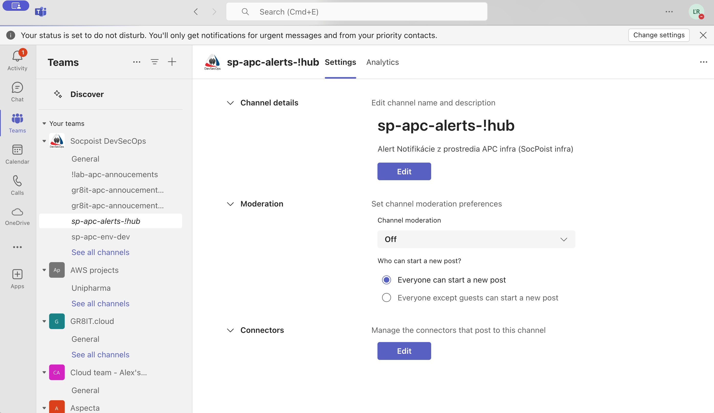
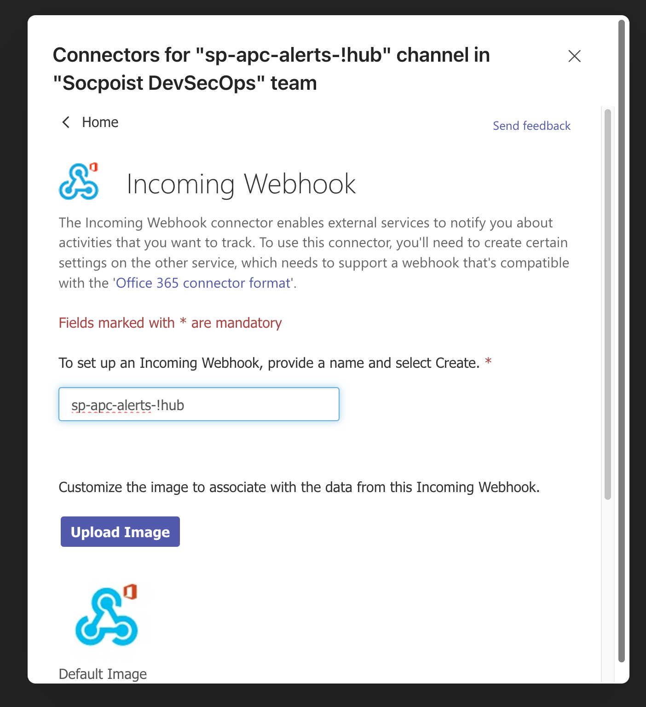
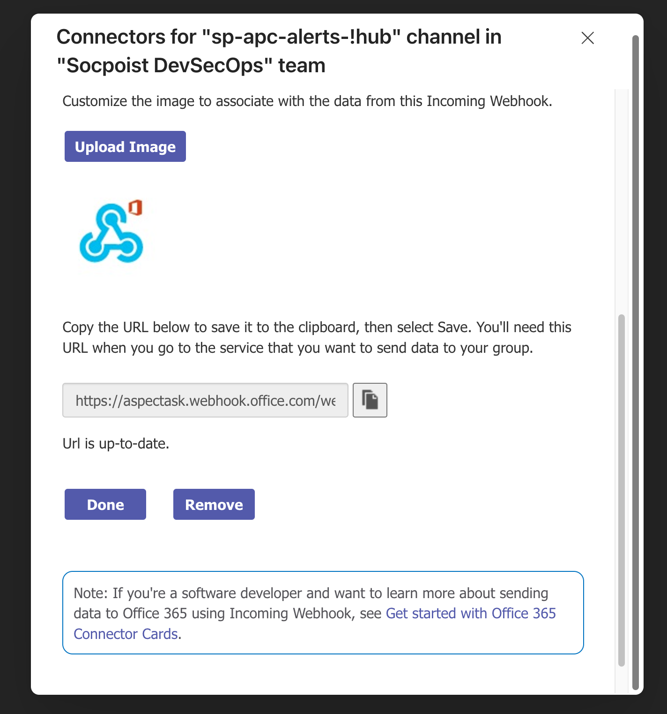

# monitoring

Helm chart for OpenShift cluster monitoring configuration. Configures the built-in OpenShift monitoring stack (cluster and user workload), AlertManager with ESO-backed secrets, Velero backup schedules, and Kyverno-based PrometheusRule generation for application namespaces.

## Deployed resources

| Resource | Kind | Namespace |
|---|---|---|
| `cluster-monitoring-config` | ConfigMap | `openshift-monitoring` |
| `alertmanager-main` | Secret | `openshift-monitoring` |
| `alertmanager-receivers` | ExternalSecret | `openshift-monitoring` |
| `cluster-alerting-rules` | AlertingRule | `openshift-monitoring` |
| `allow-proxy` | NetworkPolicy | `openshift-monitoring` |
| `user-workload-monitoring-config` | ConfigMap | `openshift-user-workload-monitoring` |
| `alertmanager-user-workload` | Secret | `openshift-user-workload-monitoring` |
| `alertmanager-uwm-receivers` | ExternalSecret | `openshift-user-workload-monitoring` |
| `allow-proxy` | NetworkPolicy | `openshift-user-workload-monitoring` |
| `user-workload-monitoring-thanos-rules` | PrometheusRule | `apc-observability` |
| `disk-raid-array-monitoring` | PrometheusRule | `openshift-monitoring` |
| `ldap-monitoring` | PrometheusRule | `apc-monitoring-bastion` |
| `vault-bastion` | Service + Endpoints + ServiceMonitor | `apc-monitoring-bastion` |
| `cluster-policy-cluster-monitoring` | ClusterPolicy | cluster-scoped |
| `monitoring-daily`, `uwm-daily` | Schedule (Velero) | `openshift-adp` |

## Dependencies

| Chart | Version | Purpose |
|---|---|---|
| `apc-global-overrides` | 1.8.0 | Global helpers (proxy, cluster name, isHub) |
| `monitoring-prometheusrules` | 1.0.6 | Alert rule library for app namespaces |
| `openshift-adp-backups` | 1.0.0 | Velero backup schedules |

## Hub vs non-hub clusters

Hub clusters (`global.apc.cluster.isHub: true`) get additional AlertManager receivers in `alertmanager-main`:
- `atlassian_aspecta_security` — OpsGenie for ACS security alerts (key: `opsgenie_key_acs`)
- `atlassian_aspecta_logs` — OpsGenie for log-based alerts (key: `opsgenie_key_logs`)

Both keys must be present in the Vault secret at `alertmanager.eso.vault.secretPath`.

## AlertManager — MS Teams setup

Alerts are routed to a MS Teams channel via Incoming Webhook. To configure:

**1.** In MS Teams, go to the target channel → **Connectors** → **Incoming Webhook** → Configure.



**2.** Create a new Incoming Webhook, set the name (e.g. `sp-apc-alerts-!hub`).



**3.** Copy the generated webhook URL — store it as `msteams_url` in the Vault secret.



## Vault secret structure

Both alertmanager secrets use `dataFrom.extract` — the entire Vault secret is transposed into a Kubernetes Secret. Required keys:

**`alertmanager.eso.vault.secretPath`** (cluster alertmanager):
| Key | Description |
|---|---|
| `msteams_url` | MS Teams Incoming Webhook URL |
| `healthchecks_url` | Healthchecks.io ping URL |
| `opsgenie_key` | OpsGenie API key |
| `opsgenie_key_acs` | OpsGenie API key for ACS alerts (hub only) |
| `opsgenie_key_logs` | OpsGenie API key for log alerts (hub only) |

**`uwmAlertmanager.eso.vault.secretPath`** (UWM alertmanager):
| Key | Description |
|---|---|
| `msteams_url` | MS Teams Incoming Webhook URL |
| `healthchecks_url` | Healthchecks.io ping URL (WatchdogUWMthanos) |
| `opsgenie_key` | OpsGenie API key |

## Key values

| Value | Default | Description |
|---|---|---|
| `clusterMonitoring.prometheus.retention` | `7d` | Cluster Prometheus retention |
| `clusterMonitoring.prometheus.storageSize` | `60Gi` | Cluster Prometheus PVC size |
| `userWorkloadMonitoring.prometheus.retention` | `14d` | UWM Prometheus retention |
| `userWorkloadMonitoring.prometheus.remoteWrite.enabled` | `true` | Enable remote write to Red Hat telemetry |
| `eso.enabled` | `true` | Enable ESO for all alertmanager secrets |
| `vaultBastionMonitoring.bastionIP` | `""` | Vault bastion IP — enables scraping when set |
| `networkPolicy.enabled` | `true` | Proxy egress NetworkPolicy |

## Usage example

```yaml
global:
  apc:
    customer: socpoistsk
    environment: dev
    cluster:
      name: dev01
      isHub: true
    proxy: http://proxysp.socpoist.sk:8080
    proxyCIDRs:
      - 10.1.1.7/32

vaultBastionMonitoring:
  bastionIP: 10.0.0.1
```
