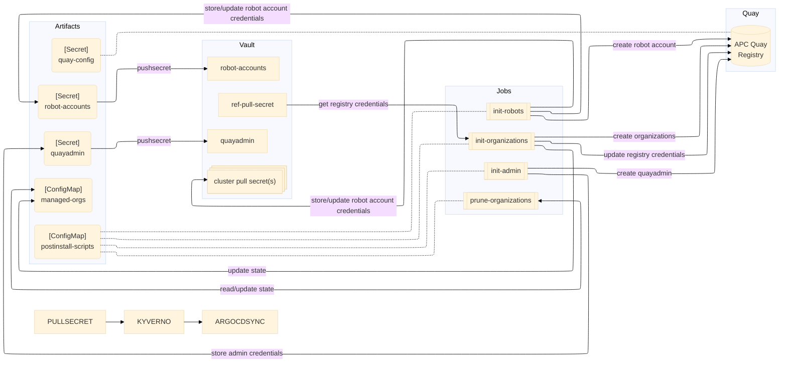

# APC Quay Registry

## High-level design

## Prerequisites:

- Quay operator (min v3.17)
- ODF Storage with noobaa
- External Secrets Operator (min. v0.11.0)
- Crossplane with Vault provider (optional - required for automatic updates of clsuter pull-secrets)
- Kyverno (optional - required for automatic sync on pull-secret update)

> [!IMPORTANT]  
> Due to the way proxy registries are bootstrapped - only "host level" proxy registries is currently supported:  i.e.: `quay.io`.
> Specifying a port, path or both will break the bootstrap process.

## Values

|Variable                       |Default            |Description |
|:--                            |:--                |:--         |
|`nameOverride`|`apc-registry`|Overrides the default (chart) name. Most manifest names use this as prefix.|
|`dbVolumeSize`|`200Gi`|Size of the quay database instance. 200Gi is the minimum.|
|`quayConfig.tagExpiration`|`2w`|How long to wait before expiring image tags.|
|`quayConfig.actionLogRetention`|`30d`|How long to keep audit logs in the database. These logs are never deleted but are moved to an archive on the preconfigured S3 bucket.|
|`quayConfig.registryTitle`|`APC Quay Registry`|Cosmetics: Registry Title|
|`quayConfig.registryTitleShort`|`APC Quay`|Cosmetics: Registry Short Title|
|`quayConfig.localAdminUser`|`quayadmin`|Name of the quay admin user - will be automatically created on during initial bootstrap.|
|`imageProxyRegistries`|`["docker.io", "quay.io", "ghcr.io", "registry.connect.redhat.com", "registry.redhat.io"]`|List of registries to be used for image proxying.|
|`vault.refPullSecretPath`|`null`|Path to a vault secret containing registry credentials. The secret key name should be `pull-secret` and the value is a dockerconfig.json format. Registry credentials found in here will be used for authenticating to the registries listed in `imageProxyRegistries`.|
|`vault.clusterPullSecretPath`|<pre>default: null  # example #1: clusterPullSecretPath:   cluster-name: vault/env/path  # example #2: clusterPullSecretPath:   my-cluster01: vault/env/path   my-cluster02: ~</pre>|Dictionary of `key`:`value` pairs where `key` is the cluster name and `value` is the vault path to this clusters pull-secret. - If the whole dictionary is set to `null` (default), no robot accounts are created. - If `key` is set to a cluster name and `value` is unset (or null), robot account for this cluster is created but credentials are not added/updated in pull-secret for this cluster in vault. - If `key` is set to a cluster name and `value` is set to a vault path, robot account for this cluster is created and pull-secret is updated with credentials to access this quay registry. The secret must already exist on vault for the update to work.|
|`ocImage`|`<output of "oc adm release info --image-for=cli">`|Image used by the postinstall jobs to perform various operations. The image must include `bash`, `oc-cli`, `curl` and `python3`. Get the image url for the cluster with `oc adm release info --image-for=cli`.|
|`argocd.syncOnPullSecretUpdate`|`true`|Forces an ArgoCD application sync each time the pull-secret (defined in `refPullSecretPath`) gets updated. This also re-creates all init jobs which in turn updates quay configuration if needed.|
|`argocd.appName`|`<Chart.name>`|ArgoCD application name for this quay deployment. This application will be set to sync on each pull-secret (`refPullSecretPath`) update if `argocd.syncOnPullSecretUpdate` is set to true.|
|`argocd.appNamespace`|`apc-gitops`|ArgoCD application for this quay deployment is created in this namespace.|
|`resourcesOverride.mirror`|<pre>limits:   cpu: 1200m   memory: 2048Mi requests:   cpu: 600m   memory: 512Mi</pre>|Requests/Limits override for the quay `mirror` component.|
|`resourcesOverride.quay`|<pre>limits:   cpu: 3000m   memory: 10Gi requests:   cpu: 2000m   memory: 8Gi</pre>|Requests/Limits override for the main `quay` component.|
|`resourcesOverride.postinstall`|<pre>limits:   cpu: 500m   memory: 1Gi requests:   cpu: 200m   memory: 512Mi</pre>|Requests/Limits override for postinstall jobs.|

## TODO

- setup LDAP for user auth (<https://docs.redhat.com/en/documentation/red_hat_quay/3.17/html/manage_red_hat_quay/ldap-authentication-setup-for-quay-enterprise>)
- allow for custom ports and paths for proxy registries
