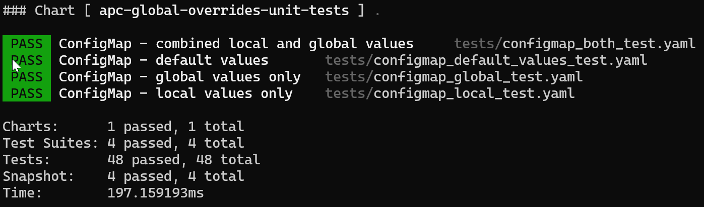

# APC Global Overrides Unit Tests

Helm chart implements helm [unit-tests](https://github.com/helm-unittest/helm-unittest) for library helm chart [apc-global-overrides](../../charts/apc-global-overrides/README.md):

- Using default chart values, i.e. empty
- Using local values only
- Using global values only
- Using local and global values, giving preference to local values

## Usage

1) [Install](https://github.com/helm-unittest/helm-unittest?tab=readme-ov-file#install) helm plugin:

   ```bash
   helm plugin install https://github.com/helm-unittest/helm-unittest.git
   ```

1) Run unit tests from within chart directory:

   ```bash
   helm unittest --strict .
   ```

   Should end similar to:

   

### Snapshots

> [!NOTE]  
> All unit test suites compare template render snapshot with the last correct state to check for different renderings not handled by standard assertions

To update snapshot = update correct state:

```bash
helm unittest --update-snapshot .
```
